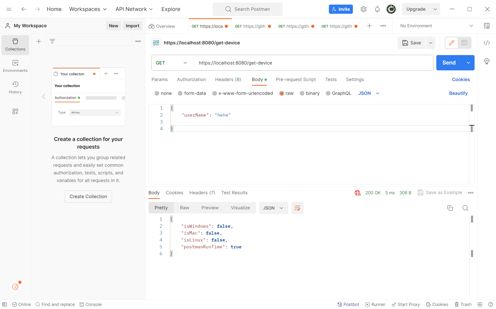
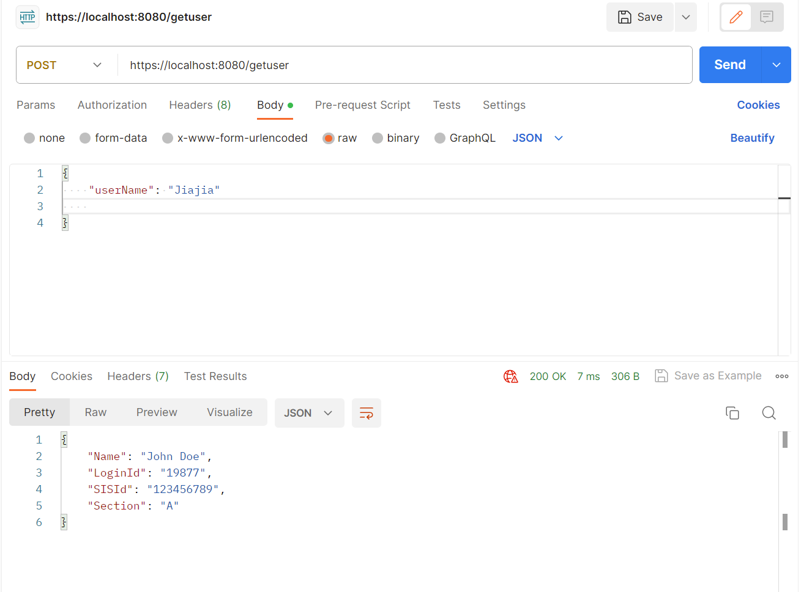
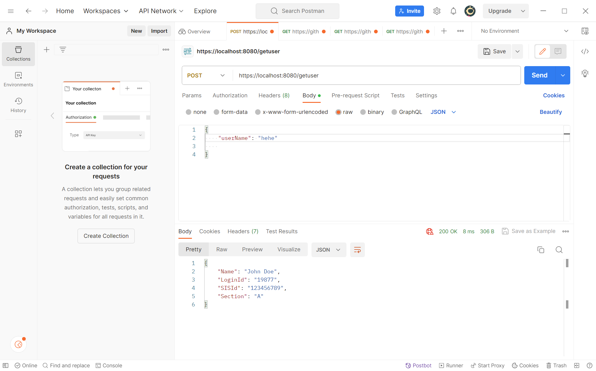

# webServiceHomework

## Description: for homework4
 Create an end-point called '/get-device', which collects the device information, and do the simple javascript to find out if the device is windows or mac or linux

 Get1 from postman
 

Get2 from windows browser

Create a post request '/getuser', and sent this information, 
whatever data is send in the payload, you should send the same response.

post1 with userName Jiajia

post2 with userName hehe
